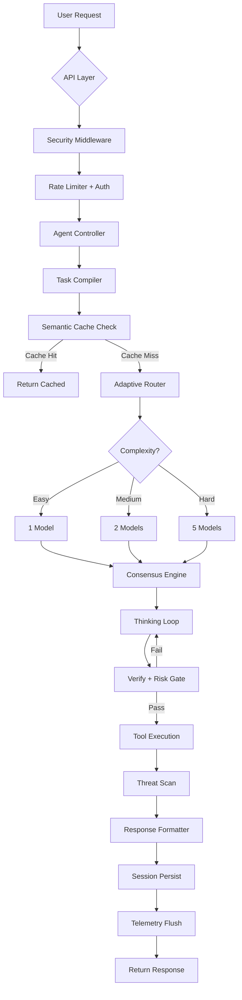

# 🏗️ Super System — Autonomous ai agent

> A comprehensive breakdown of the 6-tier autonomous AI agent system, covering the Cognitive Core, Multi-LLM Consensus, Semantic Caching, Threat Scanning, and Real-Time Streaming pipelines.

---

## Table of Contents

1. [System Overview](#system-overview)
2. [Tier 1 — Cognitive Core (Brain)](#tier-1--cognitive-core-brain)
3. [Tier 2 — Agent Orchestration](#tier-2--agent-orchestration)
4. [Tier 3 — Multi-LLM Providers](#tier-3--multi-llm-providers)
5. [Tier 4 — API & Real-Time Layer](#tier-4--api--real-time-layer)
6. [Tier 5 — Observability & Infrastructure](#tier-5--observability--infrastructure)
7. [Tier 6 — Security & Threat Defense](#tier-6--security--threat-defense)
8. [Data Flow Architecture](#data-flow-architecture)
9. [Configuration System](#configuration-system)
10. [Directory Map](#directory-map)

---

## System Overview

```
┌─────────────────────────────────────────────────────────────────┐
│                        USER / CLIENT                            │
│          (CLI · REST API · SSE Stream · WebSocket · MCP)        │
└──────────────────────────┬──────────────────────────────────────┘
                           │
┌──────────────────────────▼──────────────────────────────────────┐
│  Tier 4 — API & Real-Time         │  Tier 6 — Security         │
│  FastAPI · SSE · WebSocket · MCP  │  Threat Scanner · Sandbox  │
└──────────────────────────┬────────┴─────────────────────────────┘
                           │
┌──────────────────────────▼──────────────────────────────────────┐
│  Tier 2 — Agent Controller                                      │
│  Tool Execution · Session Mgmt · Loop Detection · Streaming     │
└───────────┬──────────────────────────────────┬──────────────────┘
            │                                  │
┌───────────▼───────────┐    ┌─────────────────▼──────────────────┐
│  Tier 1 — Brain       │    │  Tier 3 — Providers                │
│  Thinking Loop        │    │  Multi-LLM Client (5 models)       │
│  Hypothesis Engine    │    │  Adaptive Router                   │
│  Verifier Stack       │    │  Token Budget Manager              │
│  Semantic Cache       │    │  Consensus Engine                  │
│  Memory Systems       │    │  Real API Clients                  │
│  40+ Cognitive Modules│    │  (OpenAI · Claude · Gemini)        │
└───────────────────────┘    └────────────────────────────────────┘
            │
┌───────────▼─────────────────────────────────────────────────────┐
│  Tier 5 — Observability & Infrastructure                        │
│  OpenTelemetry Traces · P99 Metrics · JSONL Logs · Distributed  │
└─────────────────────────────────────────────────────────────────┘
```

---

## Tier 1 — Cognitive Core (Brain)

**Location:** `backend/brain/`  
**Purpose:** The reasoning engine — a 40+ module cognitive system that thinks, verifies, learns, and self-improves.

### Thinking Loop (`thinking_loop.py`)

The central reasoning pipeline. Runs a **Synthesize → Verify → Learn** cycle:

```
Problem → Classify Domain → Select Strategy → Generate Candidates
    → Verify (multi-stage) → Risk Assessment → Execute or Refine
    → Post-Solve Learning → Prompt Evolution
```

**Key features:**
- **Problem Classification** — Routes to optimal reasoning strategy per domain
- **Multi-Hypothesis Generation** — Produces N candidates, ranks by confidence
- **Auto-Gap Detection** — Detects missing tools/capabilities and auto-generates them via `ToolForge`
- **Continuous Learning** — Updates strategy weights, evolves prompts every N successes

### Hypothesis Engine (`hypothesis.py`)

Generates multiple parallel solution candidates using different strategies (chain-of-thought, analogical reasoning, decomposition). Weighted by historical success rates per domain.

### Verification Stack (`verifier.py`)

Multi-stage verification with:
- **Tri-Shield Scoring** — Robustness (λ₁), Detection (λ₂), Containment (λ₃), Complexity (λ₄)
- **Sandbox Execution** — Runs code in isolated subprocess with network disabled
- **Risk Assessment** — Confidence × Risk matrix gates execution

### Memory Systems

| Module | Purpose |
|---|---|
| `memory.py` | Short-term working memory with bug diary |
| `long_term_memory.py` | Persistent knowledge with decay-weighted retrieval |
| `temporal_memory.py` | Time-aware memory with event sequencing |
| `semantic_cache.py` | TF-IDF + cosine similarity query deduplication (LRU, TTL) |
| `vector_store.py` | Pure Python vector embeddings for semantic search |

### Advanced Reasoning Modules

| Module | Purpose |
|---|---|
| `advanced_reasoning.py` | Extended reasoning chains |
| `reasoning.py` | Core reasoning strategies |
| `reasoning_replay.py` | Replays successful reasoning traces for similar problems |
| `metacognition.py` | Self-awareness of reasoning quality |
| `cognitive_router.py` | Routes queries to optimal cognitive strategy |
| `confidence_oracle.py` | Calibrated confidence scoring |
| `epistemic_checker.py` | Validates knowledge claims |

### Self-Improvement Engines

| Module | Purpose |
|---|---|
| `evolution.py` | Code evolution and self-modification |
| `self_mutator.py` | Safe AST-based code mutations |
| `prompt_evolver.py` | Evolves prompts based on performance |
| `credit_assignment.py` | Attributes success/failure to specific strategies |
| `reward_model.py` | Multi-dimensional reward computation |
| `mistake_lesson_engine.py` | Extracts lessons from failures |

### Specialized Processors

| Module | Purpose |
|---|---|
| `code_analyzer.py` | Deep static analysis of code |
| `multimodal.py` | Process images, PDFs, audio, video |
| `transpiler.py` | Cross-language code translation |
| `flowchart_generator.py` | Mermaid diagram generation from reasoning traces |
| `content_factory.py` | Structured content generation |
| `problem_classifier.py` | Classifies problem type and complexity |
| `expert_reflection.py` | Domain expert consultation |
| `emotional_firewall.py` | Filters manipulative/adversarial prompts |

### Cryptographic & Integrity

| Module | Purpose |
|---|---|
| `zk_proofs.py` | Zero-knowledge proofs for verifiable computation |
| `trace_store.py` | Immutable trace storage with hash chains |
| `aesce.py` | Auto-Evolution Self-Contained Engine |

### Math Solver (`brain/solver/`)

Dedicated mathematical reasoning engine with symbolic computation.

---

## Tier 2 — Agent Orchestration

**Location:** `backend/agents/`  
**Purpose:** Orchestrates the full user-facing pipeline — from input to final response.

### Agent Controller (`controller.py`)

The **central orchestrator** that wires together all 10 subsystems:

```
User Input → Compile Task → Generate Hypotheses → Think Loop
   → Tool Execution (guarded) → Threat Scan → Build Response
   → Session Persistence → Stream Events
```

**10 Integrated Subsystems:**

1. **Compiler** (`compiler.py`) — Converts user input → structured `TaskSpec`
2. **Generator** (`generator.py`) — Produces candidate solutions
3. **Verifier** — Validates outputs before returning
4. **Tool Registry** — Dynamic tool discovery and execution
5. **Session Manager** (`sessions/`) — SQLite-backed conversation persistence
6. **Process Manager** (`process_manager.py`) — Background process execution
7. **Workspace Manager** (`workspace.py`) — File system context injection
8. **Skills Registry** (`skills/`) — Dynamic skill loading
9. **Loop Detector** (`loop_detector.py`) — Prevents infinite loops with circuit breakers
10. **Response Formatter** (`response_formatter.py`) — Structured output formatting

### Tools System (`agents/tools/`)

20+ built-in tools including file operations, web search, code execution, and more. Each tool is policy-gated via the **Tool Policy Engine** (profiles: `minimal`, `coding`, `assistant`, `full`).

### Agent Forge (`agent_forge.py`)

Dynamic agent creation — spawns specialized sub-agents at runtime for domain-specific tasks. Supports recursive spawning for hierarchical multi-agent systems.

### Safety Layer (`agents/safety/`)

- **Threat Scanner** — 4-layer detection (exact match, entropy analysis, heuristics, behavioral)
- **Quarantine System** — Isolates detected threats with cryptographic proof
- **Sandbox** (`agents/sandbox/`) — Resource-limited, network-disabled subprocess execution

### Profiles & Persona

- **Profiles** (`agents/profiles/`) — 11 pre-configured agent profiles (researcher, coder, analyst, etc.)
- **Persona** (`agents/persona/`) — Dynamic personality adaptation per domain

---

## Tier 3 — Multi-LLM Providers

**Location:** `backend/providers/`  
**Purpose:** Manages concurrent queries to multiple LLM providers and optimizes cost.

### Multi-LLM Client (`multi_llm_client.py`)

Queries up to **5 LLMs simultaneously** using `asyncio.gather`:

| Provider | Model |
|---|---|
| OpenAI | GPT-4o |
| Anthropic | Claude 3.5 Sonnet |
| Google | Gemini 1.5 Pro |
| Meta | Llama 3 70B |
| Mistral | Mistral Large |

Features a `MockAsyncProvider` for development without API keys.

### Real LLM Client (`real_llm_client.py`)

Production `httpx.AsyncClient` implementations for OpenAI, Claude, and Gemini APIs with:
- Streaming token generation
- Automatic retry with backoff
- Per-provider error handling

### Consensus Engine (`brain/consensus_engine.py`)

**LLM-as-a-Judge** ranking system:
1. Collects N responses from different providers
2. Scores each across a **multi-dimensional matrix** (Accuracy 40%, Reasoning 30%, Code Quality 20%, Formatting 10%)
3. Applies penalties for hallucination and verbosity
4. Promotes the mathematically highest-scoring response

### Adaptive Router (`providers/adaptive_router.py`)

Classifies query complexity and routes intelligently:

| Complexity | Models Queried | Cost Reduction |
|---|---|---|
| Easy | 1 (cheapest) | ~90% |
| Medium | 2 (balanced) | ~60% |
| Hard | 5 (full panel) | 0% (max quality) |

**Result: ~80% API cost reduction on average.**

### Token Budget Manager (`providers/token_budget.py`)

- Tracks daily / monthly token consumption
- Auto-downgrades to budget models (Llama 3, Mistral) at capacity thresholds
- Configurable cost-per-1K for premium ($0.03) vs budget ($0.001) models

---

## Tier 4 — API & Real-Time Layer

**Location:** `backend/api/`  
**Purpose:** Exposes the system via REST, SSE, WebSocket, and MCP protocols.

### FastAPI Server (`api/server.py`)

| Endpoint | Method | Purpose |
|---|---|---|
| `/health` | GET | Component-level health checks (DB, memory, providers) |
| `/api/chat` | POST | Conversational chat with memory |
| `/api/agent` | POST | Complex task submission with full pipeline |
| `/api/memory/stats` | GET | Memory and bug diary statistics |
| `/api/memory/failures` | GET | Failure record listing |
| `/api/chat/stream` | POST | SSE streaming chat |

**Security Middleware:**
- Rate limiting (token-bucket per client IP, configurable via `LLM_RATE_LIMIT`)
- API key authentication (`LLM_API_KEY`)
- Security headers (CSP, X-Frame-Options, HSTS)
- CORS with configurable origins
- Request body size limiting (1 MB)
- Request ID tracking

### SSE Streaming (`api/streaming.py`)

Server-Sent Events endpoint. Streams tokens as they arrive from the LLM, enabling real-time UI updates.

### WebSocket (`api/websocket_handler.py`)

Bi-directional real-time chat: `ws://host/ws/chat`. Supports persistent connections for interactive sessions.

### MCP Server (`mcp_server/`)

Model Context Protocol server for external client integration. Supports dual transports:
- **stdio** — Direct pipe communication
- **Streamable HTTP** — Network-accessible on configurable port

Exposes AI capabilities as MCP tools, resources, and prompts.

---

## Tier 5 — Observability & Infrastructure

### Telemetry (`backend/telemetry/`)

| Module | Purpose |
|---|---|
| `tracer.py` | OpenTelemetry-compatible span tracer with parent-child relationships |
| `metrics.py` | P99 histogram metrics collector for latency, throughput, and resource usage |
| `log_exporter.py` | JSONL structured log files with rotation for Grafana/ELK ingestion |

### Distributed Task Queue (`backend/distributed/`)

| Module | Purpose |
|---|---|
| `task_queue.py` | Background worker pool with priority queuing, retry logic, and dead-letter handling |

### Schemas (`backend/schemas/`)

Pydantic-compatible I/O schema validation:
- `agent_schemas.py` — Agent request/response models
- `brain_schemas.py` — Thinking loop, hypothesis, verification models
- `tool_schemas.py` — Tool input/output schemas

### Prompt Manager (`backend/prompts/`)

Centralized prompt library with:
- Versioned prompt templates per domain
- Dynamic variable injection
- A/B testing support for prompt evolution

---

## Tier 6 — Security & Threat Defense

### 4-Layer Threat Scanner

```
Input → Layer 1: Exact Pattern Match
      → Layer 2: Shannon Entropy Analysis (threshold: 7.2)
      → Layer 3: Heuristic Rules (obfuscation, suspicious patterns)
      → Layer 4: Behavioral Analysis (runtime anomalies)
      → Alert → User Approval → Quarantine or Destroy
```

- Scans files, URLs, images, and content
- Cryptographic proof of remediation (SHA-256 hash chains)
- Auto-triggers on file/URL tool operations in the Agent Controller

### Hardened Sandbox

- Isolated subprocesses with `subprocess.PIPE` and no network access
- Strict timeout enforcement
- Resource limits (CPU, memory)
- Read-only filesystem views

### Emotional Firewall (`brain/emotional_firewall.py`)

30KB module that detects and filters:
- Prompt injection attempts
- Manipulative/adversarial inputs
- Social engineering patterns

---

## Data Flow Architecture

### Request Lifecycle



### Learning Pipeline

```
Success/Failure → Trajectory Trace → Credit Assignment
    → Reward Model (multi-dimensional) → Strategy Weight Update
    → Prompt Evolution → Memory Consolidation
```

---

## Configuration System

**Location:** `backend/config/settings.py`

All configuration is centralized into typed dataclasses with auto-loading from `.env` files:

| Config Class | Controls |
|---|---|
| `BrainConfig` | Thinking loop params, hypothesis counts, confidence thresholds |
| `AgentConfig` | Tool limits, loop detection, session, process, workspace, streaming |
| `ProviderConfig` | API keys, model names, provider selection |
| `APIConfig` | Host, port, workers |
| `SSLConfig` | HTTPS/TLS certificates |
| `TokenBudgetConfig` | Daily/monthly token limits, cost-per-1K, auto-downgrade |
| `ThreatScanConfig` | Quarantine dir, entropy threshold, auto-scan toggle |

**Environment variable precedence:** Real env vars → `.env` file → defaults.

---

## Directory Map

```
super-system/
├── README.md                   # This file — project overview + architecture
├── LICENSE                     # MIT License
├── SECURITY.md                 # Security policy
│
└── backend/
    ├── main.py                 # CLI entry point (28 commands)
    ├── requirements.txt        # Python dependencies
    ├── .env.example            # Environment variable template
    │
    ├── config/
    │   └── settings.py         # 7 typed config classes
    │
    ├── brain/                  # Tier 1: Cognitive Core (41 modules)
    │   ├── thinking_loop.py    # Central Synthesize→Verify→Learn loop
    │   ├── hypothesis.py       # Multi-hypothesis generation
    │   ├── verifier.py         # Tri-Shield verification stack
    │   ├── consensus_engine.py # LLM-as-a-Judge ranking
    │   ├── semantic_cache.py   # TF-IDF query deduplication
    │   ├── vector_store.py     # Vector embeddings store
    │   ├── memory.py           # Working memory + bug diary
    │   ├── long_term_memory.py # Persistent knowledge store
    │   ├── temporal_memory.py  # Time-aware memory
    │   ├── reasoning.py        # Core reasoning strategies
    │   ├── metacognition.py    # Self-awareness of reasoning
    │   ├── zk_proofs.py        # Zero-knowledge proofs
    │   ├── emotional_firewall.py # Adversarial input defense
    │   └── solver/             # Math solver engine
    │
    ├── agents/                 # Tier 2: Agent Orchestration
    │   ├── controller.py       # Central orchestrator (10 subsystems)
    │   ├── compiler.py         # Input → TaskSpec
    │   ├── generator.py        # Candidate generation
    │   ├── agent_forge.py      # Dynamic agent creation
    │   ├── loop_detector.py    # Infinite loop prevention
    │   ├── process_manager.py  # Background process execution
    │   ├── workspace.py        # File system context injection
    │   ├── response_formatter.py
    │   ├── tools/              # 20+ built-in tools
    │   ├── safety/             # Threat scanner + quarantine
    │   ├── sandbox/            # Isolated code execution
    │   ├── sessions/           # SQLite session persistence
    │   ├── skills/             # Dynamic skill registry
    │   ├── profiles/           # 11 agent profiles
    │   ├── persona/            # Dynamic personality
    │   └── experts/            # Domain expert modules
    │
    ├── providers/              # Tier 3: Multi-LLM Providers
    │   ├── multi_llm_client.py # Concurrent 5-LLM client
    │   ├── real_llm_client.py  # Production API clients
    │   ├── adaptive_router.py  # Complexity-based routing
    │   └── token_budget.py     # Usage tracking + auto-downgrade
    │
    ├── api/                    # Tier 4: API Layer
    │   ├── server.py           # FastAPI server (REST + SSE)
    │   ├── streaming.py        # SSE streaming endpoint
    │   ├── websocket_handler.py # WebSocket real-time chat
    │   └── models.py           # Request/response models
    │
    ├── core/                   # Core infrastructure
    │   ├── model_providers.py  # Provider registry + routing
    │   ├── model_router.py     # Model selection logic
    │   └── streaming.py        # Core streaming utilities
    │
    ├── telemetry/              # Tier 5: Observability
    │   ├── tracer.py           # OpenTelemetry span tracer
    │   ├── metrics.py          # P99 histogram metrics
    │   └── log_exporter.py     # JSONL structured logs
    │
    ├── distributed/            # Distributed infrastructure
    │   └── task_queue.py       # Priority task queue + workers
    │
    ├── schemas/                # Pydantic I/O schemas
    │   ├── agent_schemas.py
    │   ├── brain_schemas.py
    │   └── tool_schemas.py
    │
    ├── prompts/                # Centralized prompt library
    │   └── prompt_manager.py
    │
    ├── mcp_server/             # MCP protocol server
    │   ├── server.py           # Tool/resource/prompt exposure
    │   └── __main__.py         # CLI entry point
    │
    ├── tests/                  # Test suites
    ├── benchmarks/             # Performance benchmarks
    └── docs/                   # Internal documentation
```

---

## CLI Commands

The `main.py` entry point exposes **28 commands**:

| Command | Description |
|---|---|
| `python main.py` | Interactive chat (default) |
| `python main.py --server` | Start FastAPI server |
| `python main.py --list-providers` | Show available model providers |
| `python main.py --evolve "prompt"` | Run Code Evolution Engine |
| `python main.py --night-watch` | Start Night Watch monitoring daemon |
| `python main.py --threat-hunt file.py` | Security audit on a file |
| `python main.py --transpile src/ --target rust` | Cross-language transpilation |
| `python main.py --devils-advocate file.py` | Devil's Advocate analysis |
| `python main.py --tutor "topic"` | Socratic tutor mode |
| `python main.py --content-factory doc.md` | Content generation pipeline |
| `python main.py --organize ~/Downloads` | Digital Estate Archivist |
| `python main.py --contract-audit nda.pdf` | Toxic Clause Hunter |
| `python main.py --deep-research "topic"` | Deep research analysis |
| `python main.py --debate "topic"` | Multi-agent debate |
| `python main.py --devops-review issue repo` | DevOps incident review |
| `python main.py --dream` | AESCE auto-evolution |
| `python main.py --swarm "task"` | Multi-agent swarm intelligence |
| `python main.py --analyze file.png` | Multimodal analysis |
| `python main.py --scan path/` | Threat scan with remediation |
| `python main.py --mcp` | Start MCP server |

---

*Last updated: February 2026*
